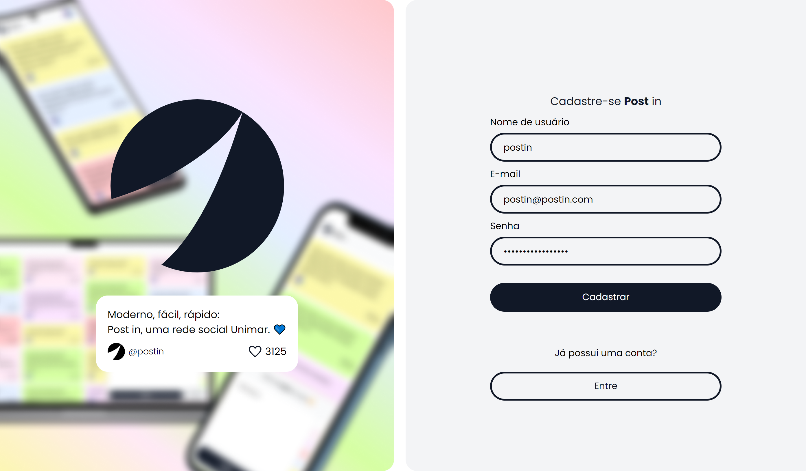
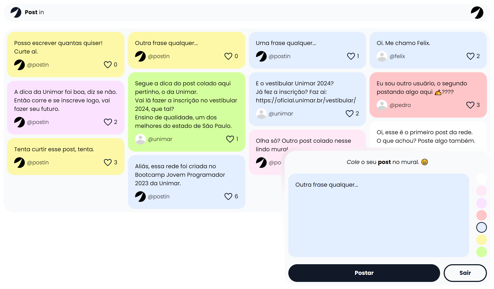
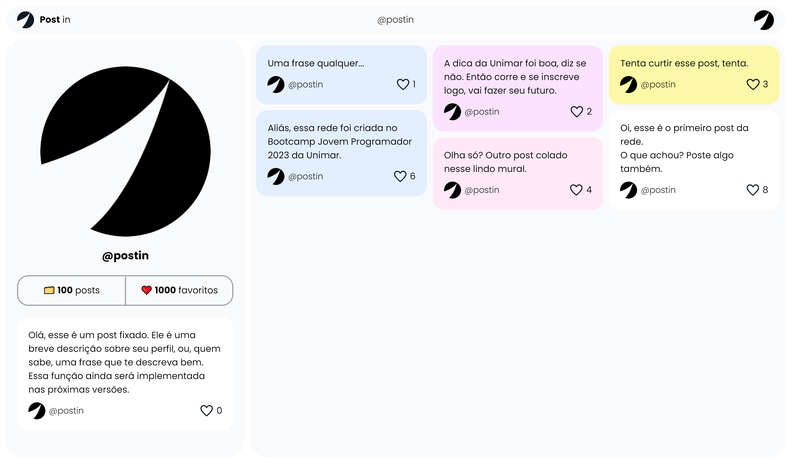

<!-- Título -->
# **Post** in, uma rede *Unimar*. 💙

<!-- Imagem de introdução. -->

  

---

<!-- Informações e dados de contato. -->

  <small>
    Desenvolvido por <a href="https://github.com/pedrohaveloso">pedrohaveloso</a> 💙 durante o <a href="https://oficial.unimar.br/eventos/bootcamp-jovem-programador/">Bootcamp Jovem Programador 2023</a>. 
  </small>
   
  <small>
    <address>
      E-mail: 
      <a href="mailto:contatopedrohalves@gmail.com">
        <em>contatopedrohalves@gmail.com</em>
      </a>
       
      WhatsApp:
      <a href="tel:+5514920021247">
        <em>14 92002-1247</em>
      </a>
    </address>
  </small>

---

<!-- Descrição -->
O **Post** in foi criado para a [*Unimar* (Universidade de Marília)](https://unimar.br/), uma rede interna e, ao desejável, externa, com o objetivo de ser simples de uso, agradável visualmente e atrativo aos públicos.

Se baseia em papeis coloridos colados em um mural. Você cola seus posts — textos curtos e com fundos da cor que desejar — no mural da rede.

Assim, todos poderão ver o que você escreveu, o que expressou.

# 🗒️ Sumário.

- [Como rodar o projeto.](#💡-como-rodar-o-projeto)
  - *Passo a passo para conseguir iniciar o projeto na sua máquina.*
- [Como o projeto funciona?](#🤔-como-o-projeto-funciona)
  - *Descrição e explicação do funcionamento completo do projeto, com adendo de features existentes, acertos e erros que devem ser corrigidos.*
- [Como usar o website?](#🤯-como-usar-o-website)
  - *Explicação de uso da rede social.*
- [Diário do desenvolvedor.](#✍️-diário-do-desenvolvedor)
  - *Diário com o dia a dia do desenvolvimento do projeto no Bootcamp.* 
- [Agradecimentos.](#💙-agradecimentos)
  - *Conclusão e agradecimentos.*

# 💡 Como rodar o projeto.

O projeto em React usa uma API em PHP (também nesse repositório, `postin/api/*`) para funcionar. Entretando, você não precisa rodar a API, pois consegui hospedar ela de maneira gratuita. Apenas rodar o projeto em React te dará acesso a rede social.

Para conseguir rodar o projeto, você precisará ter em sua máquina:
  
  - [NodeJS v18.16.0](https://nodejs.org/en) ou superior.

### Passo a passo para rodar:

1 - Clone o repositório na sua máquina.

    $ git clone https://github.com/pedrohaveloso/postin.git

2 - Entre na pasta clonada.

    $ cd postin

3 - Instale as dependências necessárias.

    $ npm install

4 - Inicie o projeto web.

    $ npm run dev

Pronto! O projeto estará rodando em sua máquina.
Crie uma conta para testar a rede, poste, favorite, faça tudo o que desejar. Logo as contas e posts criados serão apagados.

# 🤔 Como o projeto funciona?

Antes da explicação, essas são as funções que consegui implementar a tempo e estão `100% funcionais` e as funções que ainda não foram implementadas:

#### Features atuais:
- Cadastro e login de usuários;
- Publicação de novos posts;
- Favoritar posts;
- Visualizar o seu e o perfil de outras pessoas.

#### Features pendentes:
- Adicionar foto de usuário;
- Limite de caracteres para os posts;
- Salvar e contabilizar os seus posts favoritados;
- Contar a quantidade de posts que cada usuário colou no mural;
- Validação de dados de cadastro;
- Suporte a negrito, itálico e links nos posts.

Sobre as tecnologias utilizidas para desenvolver o projeto, são elas: 
- `React` + `Vite` + `TS`, `TailwindCSS` (front-end);
- `PHP`, `MySQL` (back-end).

### Como a API funciona?
Primeiramente, destaco que criei um banco de dados simples, utilizei MySQL para ele.

Já a API, criei usando PHP, não utilizei nenhuma biblioteca ou framework, apenas PHP puro, além do Composer para autoload dos arquivos.

A API possui rotas criadas com as funções que existem atualmente no aplicativo (ainda faltam algumas features), ela acessa o banco de dados e fornece a informação desejada segundo a rota. Para mais detalhes sobre as rotas existentes atualmente, leia o README.md simples da API: [Post in API](/api/).

Tentei aplicar alguns princípios de arquitetura limpa na API, como divisão em camadas e inversão de dependências, entretanto, alguns desvios ocorrem, devido ao pouco tempo de desenvolvimento.

Ademais, consegui hospedar, de maneira gratuita, a API por um certo tempo. Assim, fica mais fácil de testá-la e utilizar o front-end em qualquer máquina.

### Como o website funciona?
O front-end, website da rede social, foi criado usando, essencialmente, React com TypeScript. Ele se comunica com a API, filtra suas informações e as exibe na tela. 

Tentei dividir da maneira mais limpa possível o código da aplicação, usando componentes etc., todavia, não possuo experiência anterior em React/TS, portanto, muita coisa deve estar incorreta. Mesmo assim, existe documentação dos componentes criados.

Para estilização, optei por usar TailwindCSS, para facilitar/agilizar a programação do site — pelo curto tempo para desenvolver — e, ainda sim, não abdicar de um visual elegante, minimalista e agradável.

# 🤯 Como usar o website?

A rede social é simples e de fácil uso: crie uma conta, crie um post com o texto que quiser e sua cor favorita, cole no mural. Pronto, você está dentro do **Post** in.

Mas que tal ver algumas prints com cada passo, para facilitar o entendimento?

#### 1 - Crie uma conta na rede.

Use o nome que achar que melhor o represente, coloque seu e-mail e senha também.

#### 2 - Poste a mensagem que desejar.

Ela deve ser curta, mas pode ter uma cor de fundo que dê destaque.

#### 3 - Curta posts e veja os perfis de quem quiser.

Agora, você pode interagir com os outros.

#### 4 - Pronto.

Agora, você já aprendeu o básico da rede. Ela ainda possui outras funcionalidades, teste tudo que quiser.

# ✍️ Diário do desenvolvedor.

Esse diário, escrito durante o desenvolvimento da ideia e do projeto no Bootcamp, descreve um pouco do processo de criação. Dia após dia.

Foco muito no meu aprendizado, já que eu não tinha nenhum conhecimento em React e TS/JS antes desse Bootcamp. Se trata de um texto mais pessoal, um plano de fundo do desenvolvimento.

  
<code>21/08/2023</code> - Início do desenvolvimento.

  
  ## Início do desenvolvimento.
  Com a introdução da temática do Bootcamp, sendo estabelecido como foco a criação de uma solução, qual de tema livre, para a Unimar utilizando React, estou começando a pensar em algum tipo de solução.

  Estou um pouco desconfiante, já que nunca programei nada em React, muito menos usar TS ou JS de alguma maneira extensiva.

  Achei interessante a ideia de criar uma rede social interna, talvez externa, na medida do desejável, para a universidade.

  Pensei em um nome, *Post in*, algo que remeta a "postar em", coisa do tipo. Também imagino algo interessante: que ela seja baseada em _post its_, acredito que não possa ser dito que ela é, já que isso é uma marca registrada, mas seria algo parecido.

  Você colar seus posts em um mural na rede, com textos curtos e cores que expressem uma emoção.

  Poderia ser usada pelo estudantes da Unimar? Talvez por fora, imagino algo desse modo.

  
<code>22/08/2023</code> - Ideia estabelecida.

  
  ## Ideia estabelecida.
  Cheguei a conclusão que minha ideia de ontem seria, realmente, interessante — pelo menos na minha visão.

  Comecei a desenvolver um pouco do design no Figma, apenas uma base sólida, não desejo criar tudo lá, pois pode demorar demais, quero logo começar a programar.

  Portanto, iniciei a programação de algumas telas e uma lógica.

  Estou usando TailwindCSS, não tinha tido contato com ele antes, mas achei muito útil, principalmente pelo curto tempo de desenvolvimento que tenho.

  Adicionei duas dependências no projeto, desejo que sejam as únicas:  
  - react-router-dom
  - react-responsive-masonry

  A primeira, para criar rotas, pesquisei e vi que é a melhor para isso.
  A segunda, para um grid masonry, como há pouco tempo para o projeto, não quero gastar tempo criando algum componente para isso, soma-se meu pouco conhecimento em TS/React, tentarei não arriscar.

  
<code>23/08/2023</code> - Criação da API.

  ## Criação da API.
  Revisando minha ideia, achei interessante não criar apenas um visual, mas também uma rede que seja funcional no momento da entrega. 
  
  Estou iniciando o desenvolvimento de uma API para ela, criei em PHP, linguagem que tenho mais conhecimento e que, ao mesmo tempo, julgo mais rápida para isso, além de ser mais fácil, mas minhas condições (nenhum dinheiro) de hospedar caso seja necessário, para testes, obviamente, em algo gratuito.

  Aplicando conceitos de arquitetura limpa nessa API, quero criar algo o mais limpo possível, ainda estou estudando sobre esse tema, mas desejo, ainda sim, desenvolver algo que você olhe e diga: — que código limpo!
  
  E espero conseguir.

  
<code>24/08/2023</code> - Design concreto.

  ## Design concreto.
  Cheguei em um momento onde tenho o design da ideia concreto, acredito que está sólido, seguindo um bom padrão.

  A tela de boas-vindas está concluída, responsiva e agradável.

  Ademais, a tela inicial também está bem evoluída, criei o componente de formulário para a criação de posts, os posts já estão sendo exibidos, mas, no momento, apenas vindo de uma lista aleatória gerada. Espero logo puxá-los de um backend.

  
<code>25/08/2023</code> - Componentes e mais telas.

  ## Componentes e mais telas.
  Componentizei algumas coisas, a navbar como exemplo.

  Também criei a tela de perfil (do usuário atual logado).

  Está tudo responsivo, pessoalmente, me orgulho um pouco disso, não um orgulho arrogante, mas de pura felicidade. Faz 4 dias que eu pouco estava mexendo em algo web usando HTML/TS/React/TailwindCSS, fiquei muito preso no Flutter ultimamente, mas estou pegando bem o jeito nisso, só não sei se seguindo as melhores práticas, mas estou tentando.

  Estou criando componentes para os icones em SVG, acredito ser algo interessante, pois me possibilita usar o Tailwind para customizá-los quando quiser.

  Hoje foi um dia menos produtivo que os outros, mas continuo firme.

  
<code>26/08/2023</code> - Menu de ações e README.md.

  ## Menu de ações e README.md.
  O título de hoje remete a poucas coisas, correto?
  Pois é, não consegui desenvolver quase nada hoje, tanto por um desânimo repentino, quanto por compromissos.

  Criei apenas um menu de ações na Navbar e fiz algumas alterações no README.md, ia incluir o diário do desenvolvedor nele, mas vou deixar para o final do projeto.

  Amanhã e nos próximos dias vou tentar me animar mais, quero continuar e concluir logo esse projeto, estou gostando da ideia e do desenvolvimento, acredito que terá alguma utilidade à universidade.

  Amanhã também desejo dar uns retoques na arquitetura do projeto, ao menos no código atual, limpar toda a baboseira que criei em alguns momentos, refleti e percebi alguns códigos sujos criados. Na questão arquitetura, darei meu máximo, pois ainda não entendi como posso aplicar alguns conceitos que conheço no React.

  
<code>27/08/2023</code> - Refatorações e Login.

  ## Refatorações e Login.
  Hoje foi um dia bem produtivo, refatorei completamente o código do site, refiz componentes, páginas etc.

  Deixei todas as tags que vi semânticas, o máximo possível. Os novos componentes são mais úteis e não apenas me atrapalham por causa de seus props — os que eu havia criado anteriormente, como ainda tinha menos conhecimento, estavam criando mais dor de cabeça que tudo.

  Também tentei "isolar" alguns estados denntro de componentes específicos, ainda não entendi totalmente o gereciamento de estado do React, mas achei interessante tentar isolar cada estado num componente e deixar todas as páginas limpas, sem nenhum estado global, faz sentido?

  Resumidamente, o dia se baseou nisso, agora o projeto está bem mais limpo, também adicionei documentação nos componentes e páginas, ficando mais fácil o entendimento.

  Após essa limpeza no código, comecei outra bagunça: a função de login.
  Como já tenho boa parte do visual pronto, estou me concentrando nas partes funcionais, a parte de login foi aparentemente concluída. 
  
  Você já consegue logar e agora só pode acessar as páginas internas (sem ser a de boas-vindas) estando logado.

  Porém, acredito que fiz muitas gambiarras para que a função de login faça seu papel (funcionar) — POGzão (Programação Orientada a Gambiarra) na veia, como diriam os bons programadores de PHP.

  Quando aprender mais sobre TypeScript, JavaScript, React etc., pretendo melhorar essa função, mas, no momento, é o que tive a capacidade de fazer.

  
<code>28/08/2023</code> - API e mais funções.

  ## API e mais funções.
  O dia hoje foi focado em desenvolver mais funções na API, pra amanhã implantar elas no frontend (React) e transformar o projeto em funcional.

  Terminei as funções para cadastro e login de usuário, além das funções básicas envolvendo posts, como criar, favoritar, desfavoritar, obter todos etc.

  Já amanhã, pretendo continuar no React para aplicar essas funções (criar a comunicação com a API).

  
<code>29/08/2023</code> - A rede funcional.

  ## A rede funcional.
  O dia hoje foi aproveitando tudo feito ontem, as funções na API, implementando a comunicação do front-end com ela.

  Conseguir lançar a API de maneira gratuita, isso vai facilitar a continuação do projeto e o uso de outras pessoas, quem quiser testar poderá apenas clonar o projeto em React, rodar e pronto.

  Hoje, terminei as features para criação de post, de conta, de login, para favoritar e desfavoritar posts, além de obter todos os posts e de apenas um usuário desejado. Tudo pronto e implementado no front-end.

  Basta corrigir alguns erros e *feiuras* no quesito visual que sobraram após implementar essas features.

  Também preciso implementar outras coisas que existem apenas de maneira visual: aparecer a quantidade de favoritos e posts de um usuário; salvar os posts que você favoritou, pois estão apenas sendo favoritados, sem salvar que foi você, entre outras coisas.

  Fiquei muito feliz, pois hoje rendeu de maneira absurda, a rede já está "funcionando", ainda faltam muitos detalhes, mas acredito que vou entregar algo bem conclusivo até sexta-feira.

  
<code>30/08/2023</code> - Mais documentação...

  ## Mais documentação...
  Hoje o dia foi apenas documentas, não tive tanto tempo para programar, então preferi apenas escrever documentação.
  
  Tudo nesse README.md, coloquei mais algumas coisas sobre o funcionamento da rede, agradecimentos etc.

  Também pedi opinião da ideia do projeto para um dos mentores.
  Apenas isso, foi um dia mais leve. 
  
  Amanhã vou tentar fazer mais.

`31/08/2023` - O projeto foi enviado.

# 💙 Agradecimentos.

Agradeço, desde já, à Unimar, pelo evento do Bootcamp. 

Sem dúvidas, levou muita experiência nova, não apenas a mim, mas também para outras diversas pessoas.

Agradeço, também, a todos os mentores e professores do Bootcamp, pelo apoio durante o desenvolvimento nas aulas. 

---

<!-- Informações e dados de contato. -->

  <small>
    Desenvolvido por <a href="https://github.com/pedrohaveloso">pedrohaveloso</a> 💙 durante o <a href="https://oficial.unimar.br/eventos/bootcamp-jovem-programador/">Bootcamp Jovem Programador 2023</a>. 
  </small>
   
  <small>
    <address>
      E-mail: 
      <a href="mailto:contatopedrohalves@gmail.com">
        <em>contatopedrohalves@gmail.com</em>
      </a>
       
      WhatsApp:
      <a href="tel:+5514920021247">
        <em>14 92002-1247</em>
      </a>
    </address>
  </small>

---
